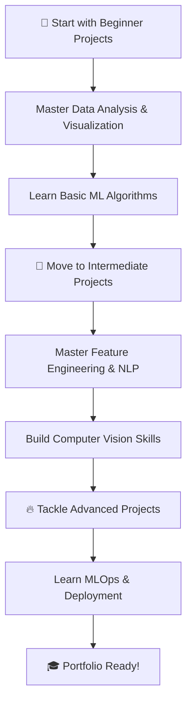

# 🚀 Data Science Projects Roadmap 🔬📈

> *From beginner to advanced: Your complete guide to hands-on data science projects*

## 📋 Table of Contents
- [🎯 Overview](#-overview)
- [🔰 Beginner Projects](#-beginner-level-projects)
- [🚀 Intermediate Projects](#-intermediate-level-projects)
- [🔥 Advanced Projects](#-advanced-level-projects)
- [📚 Learning Path](#-learning-path)
- [🛠️ Tools & Technologies](#️-tools--technologies)
- [� Success Tips](#-success-tips)

## 🎯 Overview

This curated collection contains **30+ real-world data science projects** designed to take you from complete beginner to advanced practitioner. Each project is carefully selected to build specific skills and showcase different aspects of the data science workflow.

### 🎪 **Project Difficulty Levels**
| Level | Focus Areas | Time Investment | Skills Gained |
|-------|-------------|-----------------|---------------|
| � **Beginner** | Data manipulation, basic analysis | 1-3 days each | Python, Pandas, Matplotlib |
| 🚀 **Intermediate** | ML algorithms, feature engineering | 3-7 days each | Scikit-learn, NLP, Advanced ML |
| 🔥 **Advanced** | Deep learning, deployment, MLOps | 1-4 weeks each | TensorFlow, Cloud, Production |

---

## 🔰 Beginner-Level Projects
*Foundation building with Python, Excel, NumPy, Pandas*

### 📊 **Data Analysis & Visualization**
1️⃣ **Exploratory Data Analysis (EDA) on Titanic Dataset**
   - *Skills*: Data cleaning, statistical analysis, survival prediction insights
   - *Tools*: Pandas, Matplotlib, Seaborn
   - *Duration*: 2-3 days

2️⃣ **COVID-19 Trends Analysis with Pandas & Matplotlib**
   - *Skills*: Time series analysis, data aggregation, trend visualization
   - *Tools*: Pandas, Matplotlib, Plotly
   - *Duration*: 2-3 days

3️⃣ **Movie Data Visualization Project using Seaborn**
   - *Skills*: Advanced plotting, correlation analysis, storytelling with data
   - *Tools*: Seaborn, Pandas, Matplotlib
   - *Duration*: 2-3 days

### 🧹 **Data Processing & Web Development**
4️⃣ **BMI Calculator Web App (Streamlit)**
   - *Skills*: Web app development, user interface design, health analytics
   - *Tools*: Streamlit, Python
   - *Duration*: 1-2 days

5️⃣ **Data Cleaning + Null Handling on Messy CSVs**
   - *Skills*: Data preprocessing, missing value imputation, data quality assessment
   - *Tools*: Pandas, NumPy
   - *Duration*: 2-3 days

6️⃣ **Web Scraping Project (News Headlines/Weather)**
   - *Skills*: Web scraping, API integration, data collection automation
   - *Tools*: Beautiful Soup, Requests, Selenium
   - *Duration*: 3-4 days

### 🤖 **Introductory Machine Learning**
7️⃣ **Student Performance Correlation Heatmap**
   - *Skills*: Correlation analysis, feature relationships, educational data insights
   - *Tools*: Seaborn, Pandas, Statistical analysis
   - *Duration*: 1-2 days

8️⃣ **Basic Classification: Iris Dataset (Scikit-learn)**
   - *Skills*: Classification algorithms, model evaluation, feature importance
   - *Tools*: Scikit-learn, Pandas
   - *Duration*: 2-3 days

9️⃣ **Diabetes Prediction using Logistic Regression**
   - *Skills*: Binary classification, medical data analysis, model interpretation
   - *Tools*: Scikit-learn, Pandas
   - *Duration*: 3-4 days

🔟 **Temperature Time Series Analysis**
   - *Skills*: Time series visualization, trend analysis, climate data
   - *Tools*: Pandas, Matplotlib, Time series libraries
   - *Duration*: 2-3 days

---

## 🚀 Intermediate-Level Projects
*Advanced ML, feature engineering, and visual storytelling*

### 🎯 **Unsupervised Learning & Clustering**
1️⃣ **Customer Segmentation using K-Means Clustering**
   - *Skills*: Clustering algorithms, customer analytics, business insights
   - *Tools*: Scikit-learn, Pandas, Plotly
   - *Duration*: 4-5 days
   - *Dataset*: E-commerce customer data

2️⃣ **Market Basket Analysis for Retail Optimization**
   - *Skills*: Association rules, Apriori algorithm, retail analytics
   - *Tools*: mlxtend, Pandas, NetworkX
   - *Duration*: 3-4 days

### 🗣️ **Natural Language Processing**
3️⃣ **Sentiment Analysis on Product Reviews**
   - *Skills*: Text preprocessing, sentiment classification, NLP pipelines
   - *Tools*: NLTK, TextBlob, Scikit-learn
   - *Duration*: 5-6 days
   - *Dataset*: Amazon product reviews

4️⃣ **Fake News Classifier using TF-IDF + Naive Bayes**
   - *Skills*: Text vectorization, classification, misinformation detection
   - *Tools*: Scikit-learn, NLTK, Pandas
   - *Duration*: 4-5 days

5️⃣ **Resume Screening Tool using NLP & Cosine Similarity**
   - *Skills*: Document similarity, text matching, HR automation
   - *Tools*: spaCy, Scikit-learn, NLTK
   - *Duration*: 5-7 days

### 🏠 **Regression & Prediction**
6️⃣ **House Price Prediction using Multiple Regression**
   - *Skills*: Feature engineering, regression analysis, real estate analytics
   - *Tools*: Scikit-learn, Pandas, Feature selection
   - *Duration*: 4-5 days
   - *Dataset*: Boston Housing / California Housing

7️⃣ **Telecom Customer Churn Prediction**
   - *Skills*: Binary classification, customer retention, business metrics
   - *Tools*: Scikit-learn, Pandas, Imbalanced-learn
   - *Duration*: 5-6 days

### 🖼️ **Computer Vision & Deep Learning Intro**
8️⃣ **Image Classification using CNN (MNIST/CIFAR-10)**
   - *Skills*: Convolutional neural networks, image preprocessing, deep learning
   - *Tools*: TensorFlow/Keras, OpenCV
   - *Duration*: 6-7 days

### 🔍 **Feature Engineering & AutoML**
9️⃣ **Feature Selection Techniques on Medical Datasets**
   - *Skills*: Feature selection, medical data analysis, model optimization
   - *Tools*: Scikit-learn, Statistical tests, Medical datasets
   - *Duration*: 4-5 days

🔟 **Interactive ML Dashboard with Streamlit**
   - *Skills*: Web development, model deployment, interactive visualization
   - *Tools*: Streamlit, Plotly, Scikit-learn
   - *Duration*: 5-6 days

1️⃣1️⃣ **Automated EDA Report Generation**
   - *Skills*: Report automation, data profiling, workflow optimization
   - *Tools*: pandas-profiling, ydata-profiling, Sweetviz
   - *Duration*: 3-4 days

---

## 🔥 Advanced-Level Projects
*Deep learning, deployment, big data, and production systems*

### 🤖 **AI & Large Language Models**
1️⃣ **GPT-Powered Customer Support Chatbot**
   - *Skills*: LLM integration, conversational AI, prompt engineering
   - *Tools*: OpenAI API, LangChain, Streamlit, Vector databases
   - *Duration*: 2-3 weeks
   - *Features*: Context awareness, FAQ automation, sentiment analysis

2️⃣ **Language Translation Model using Transformers**
   - *Skills*: Transformer architecture, sequence-to-sequence, multilingual NLP
   - *Tools*: Hugging Face, PyTorch, Tokenizers
   - *Duration*: 3-4 weeks

### 🚀 **Model Deployment & MLOps**
3️⃣ **ML Model API Deployment using FastAPI**
   - *Skills*: API development, model serving, containerization, monitoring
   - *Tools*: FastAPI, Docker, Kubernetes, Prometheus
   - *Duration*: 1-2 weeks
   - *Features*: Auto-documentation, load balancing, health checks

4️⃣ **End-to-End MLOps Pipeline**
   - *Skills*: CI/CD for ML, model versioning, automated retraining
   - *Tools*: MLflow, Apache Airflow, GitHub Actions, AWS/GCP
   - *Duration*: 3-4 weeks
   - *Features*: Model registry, A/B testing, drift detection

### 📈 **Time Series & Financial Analytics**
5️⃣ **Stock Price Prediction with LSTM & Prophet**
   - *Skills*: Time series forecasting, financial analysis, deep learning
   - *Tools*: TensorFlow, Prophet, yfinance, Technical indicators
   - *Duration*: 2-3 weeks
   - *Features*: Multi-step forecasting, risk analysis, trading signals

### 🖼️ **Advanced Computer Vision**
6️⃣ **Transfer Learning: Multi-class Image Classification**
   - *Skills*: Transfer learning, fine-tuning, advanced CNNs
   - *Tools*: TensorFlow, Pre-trained models (ResNet, VGG, EfficientNet)
   - *Duration*: 2-3 weeks
   - *Dataset*: Custom business dataset

7️⃣ **Real-time Emotion Detection (Webcam + CNN)**
   - *Skills*: Real-time processing, computer vision, emotion AI
   - *Tools*: OpenCV, TensorFlow, Streamlit, Face detection
   - *Duration*: 2-3 weeks
   - *Features*: Live streaming, emotion analytics dashboard

### 🛡️ **Security & Anomaly Detection**
8️⃣ **Fraud Detection Pipeline (Imbalanced Data)**
   - *Skills*: Anomaly detection, imbalanced learning, financial security
   - *Tools*: Imbalanced-learn, Isolation Forest, SMOTE, Optuna
   - *Duration*: 2-3 weeks
   - *Features*: Real-time scoring, alert system, model interpretability

### 📊 **Big Data & Scalability**
9️⃣ **Large-scale Data Processing using PySpark**
   - *Skills*: Distributed computing, big data processing, cloud computing
   - *Tools*: Apache Spark, Databricks, AWS EMR, Delta Lake
   - *Duration*: 2-3 weeks
   - *Dataset*: Multi-GB datasets

### 🎯 **Recommendation Systems**
🔟 **Hybrid Recommender System (Content + Collaborative)**
   - *Skills*: Recommendation algorithms, matrix factorization, deep learning
   - *Tools*: Surprise, LightFM, TensorFlow Recommenders
   - *Duration*: 2-3 weeks
   - *Features*: Cold start handling, real-time recommendations

---

## � Learning Path

### 🎯 **Recommended Learning Sequence**


### ⏱️ **Time Investment Guide**
| Phase | Duration | Projects | Key Milestones |
|-------|----------|----------|----------------|
| **Foundation** | 4-6 weeks | 3-4 beginner projects | Python mastery, data manipulation |
| **Skill Building** | 8-10 weeks | 4-5 intermediate projects | ML algorithms, domain expertise |
| **Specialization** | 12-16 weeks | 3-4 advanced projects | Production systems, portfolio |

---

## 🛠️ Tools & Technologies

### 📊 **Core Data Science Stack**
| Category | Tools | Purpose |
|----------|-------|---------|
| **Languages** | Python, SQL, R | Programming & querying |
| **Data Manipulation** | Pandas, NumPy, Polars | Data processing & analysis |
| **Visualization** | Matplotlib, Seaborn, Plotly | Charts & interactive plots |
| **Machine Learning** | Scikit-learn, XGBoost, LightGBM | Traditional ML algorithms |
| **Deep Learning** | TensorFlow, PyTorch, Keras | Neural networks & AI |

### � **Deployment & Production**
| Category | Tools | Purpose |
|----------|-------|---------|
| **Web Frameworks** | Streamlit, FastAPI, Flask | Web apps & APIs |
| **Cloud Platforms** | AWS, GCP, Azure | Scalable infrastructure |
| **Containerization** | Docker, Kubernetes | Application packaging |
| **MLOps** | MLflow, Kubeflow, Weights & Biases | Model lifecycle management |
| **Version Control** | Git, GitHub, GitLab | Code management |

### 🔧 **Specialized Tools**
| Domain | Tools | Applications |
|--------|-------|-------------|
| **NLP** | NLTK, spaCy, Hugging Face | Text processing & LLMs |
| **Computer Vision** | OpenCV, PIL, Albumentations | Image processing |
| **Time Series** | Prophet, Statsmodels | Forecasting & analysis |
| **Big Data** | Apache Spark, Dask | Large-scale processing |

---

## 📌 Success Tips

### 🎯 **Project Excellence Framework**

#### 📋 **Before Starting Any Project**
- [ ] **Define clear objectives** - What problem are you solving?
- [ ] **Research the domain** - Understand the business context
- [ ] **Set success metrics** - How will you measure success?
- [ ] **Plan your approach** - Break down into manageable steps

#### 🔄 **During Development**
- [ ] **Follow best practices** - Clean code, proper documentation
- [ ] **Version control everything** - Commit frequently with clear messages
- [ ] **Test incrementally** - Validate each step before moving forward
- [ ] **Handle edge cases** - Think about what could go wrong

#### � **Project Completion**
- [ ] **Create compelling visualizations** - Tell a story with your data
- [ ] **Write comprehensive documentation** - Others should understand your work
- [ ] **Reflect on learnings** - What worked? What didn't? Why?
- [ ] **Share your insights** - Blog posts, LinkedIn, presentations

### 💡 **Professional Project Structure**
```
📁 project_name/
├── 📄 README.md              # Project overview & instructions
├── 📄 requirements.txt       # Dependencies
├── 📄 .gitignore            # Git ignore file
├── 📁 data/
│   ├── 📁 raw/              # Original, immutable data
│   ├── 📁 processed/        # Cleaned, transformed data
│   └── 📁 external/         # Third-party data
├── 📁 notebooks/
│   ├── 📄 01_data_exploration.ipynb
│   ├── 📄 02_data_cleaning.ipynb
│   └── 📄 03_modeling.ipynb
├── 📁 src/
│   ├── 📄 __init__.py
│   ├── 📄 data_processing.py
│   ├── 📄 model.py
│   └── 📄 utils.py
├── 📁 models/               # Trained models and pickles
├── 📁 reports/              # Generated analysis reports
│   ├── 📁 figures/          # Graphics and plots
│   └── 📄 final_report.md
├── 📁 tests/                # Unit tests
└── 📁 deployment/           # Deployment configurations
```

### 🌟 **Portfolio Building Strategy**

#### 📈 **Create Impact-Driven Projects**
1. **Choose relevant problems** - Select projects that matter to industries you're interested in
2. **Show business value** - Quantify the impact of your solutions
3. **Demonstrate end-to-end skills** - From data collection to deployment
4. **Include different project types** - Analysis, prediction, recommendation, automation

#### 📢 **Effective Communication**
- **Write clear README files** with problem statement, methodology, and results
- **Create compelling visualizations** that tell a story
- **Document your learning journey** - challenges faced and how you solved them
- **Share on multiple platforms** - GitHub, LinkedIn, personal blog, Kaggle

#### 🔗 **Networking & Visibility**
- **Engage with the community** - Comment on others' work, ask questions
- **Share your progress** - Regular updates on learning milestones
- **Seek feedback** - Ask experienced practitioners to review your work
- **Contribute to open source** - Help improve existing tools and libraries

### 📊 **Success Metrics to Track**
| Metric | Beginner Target | Intermediate Target | Advanced Target |
|--------|----------------|-------------------|-----------------|
| **Projects Completed** | 5-7 projects | 8-12 projects | 15+ projects |
| **GitHub Contributions** | 50+ commits | 200+ commits | 500+ commits |
| **Technical Skills** | 3-5 tools | 8-12 tools | 15+ tools |
| **Domain Knowledge** | 1-2 domains | 3-4 domains | 5+ domains |
| **Community Engagement** | 5+ interactions/month | 15+ interactions/month | 30+ interactions/month |

---

## 🚀 **Next Steps**

### 🎯 **Getting Started Today**
1. **Assess your current level** - Take our skill assessment quiz
2. **Choose your first project** - Pick something that excites you
3. **Set up your environment** - Install necessary tools and libraries
4. **Join the community** - Connect with other learners and practitioners
5. **Start building** - Begin with small, achievable goals

### 📈 **Long-term Goals**
- **Build a compelling portfolio** with 10-15 diverse projects
- **Develop domain expertise** in 2-3 areas of interest
- **Master the full data science pipeline** from data to deployment
- **Contribute to the community** through open source and knowledge sharing
- **Land your dream role** in data science, ML engineering, or AI research

---

## 🤝 **Community & Support**

### 💬 **Get Help & Share Progress**
- **GitHub Discussions** - Ask questions and share your projects
- **Discord/Slack Communities** - Real-time chat with fellow learners
- **LinkedIn Groups** - Professional networking and opportunities
- **Reddit Communities** - r/MachineLearning, r/DataScience, r/LearnPython

### 🎓 **Additional Resources**
- **Free Datasets** - Kaggle, UCI ML Repository, Google Dataset Search
- **Learning Platforms** - Coursera, edX, fast.ai, Towards Data Science
- **Documentation** - Official docs for all tools and libraries
- **YouTube Channels** - 3Blue1Brown, StatQuest, Two Minute Papers

---

*Happy coding! 🎉 Remember: The best way to learn data science is by doing projects. Start small, stay consistent, and don't be afraid to experiment!*